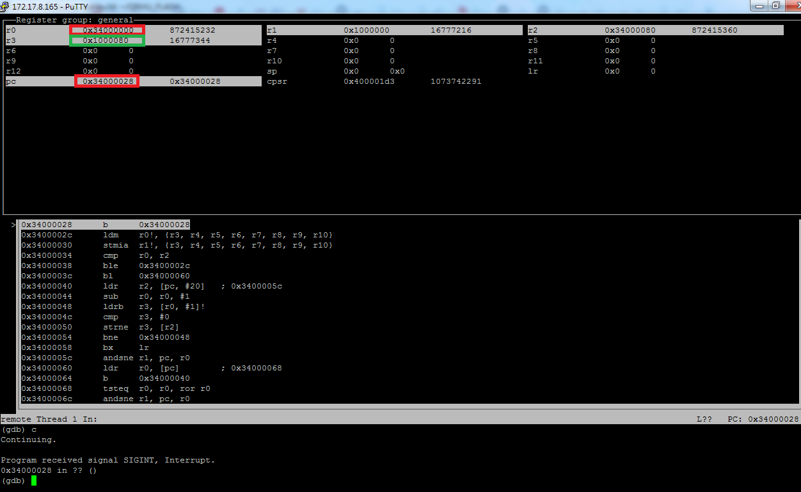
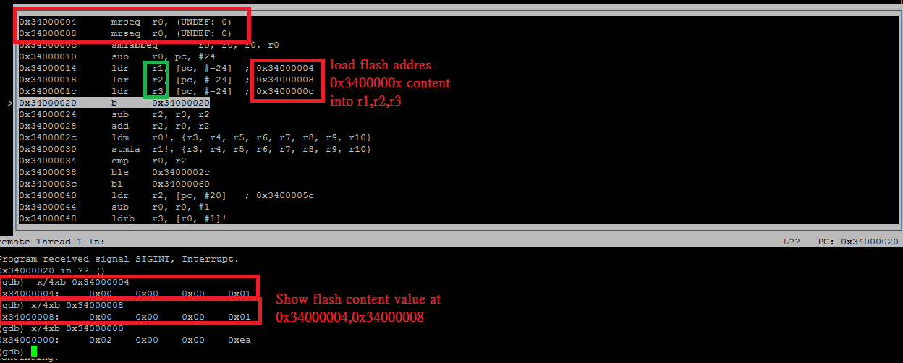

# start.S 
  
   
   

* You can see debug layout assembly content is not correct to real one.
  r1, r2, r3 says flash address (0x34000000) but are virtual memory address indeed (0x100000000)

* need stop at some loop point (b . ) and check register value .
