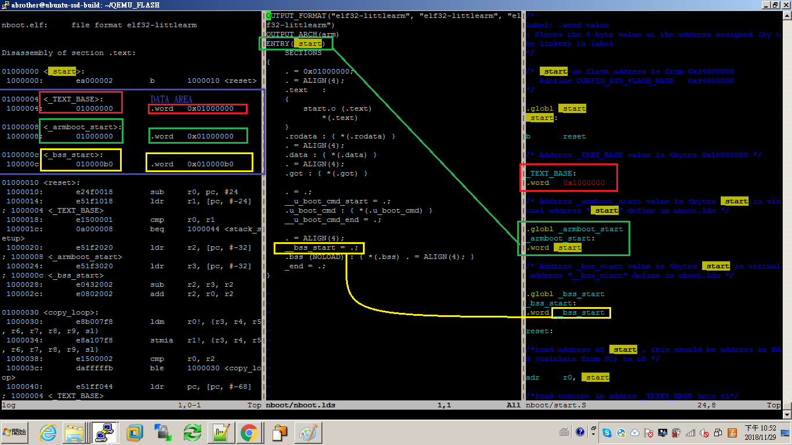
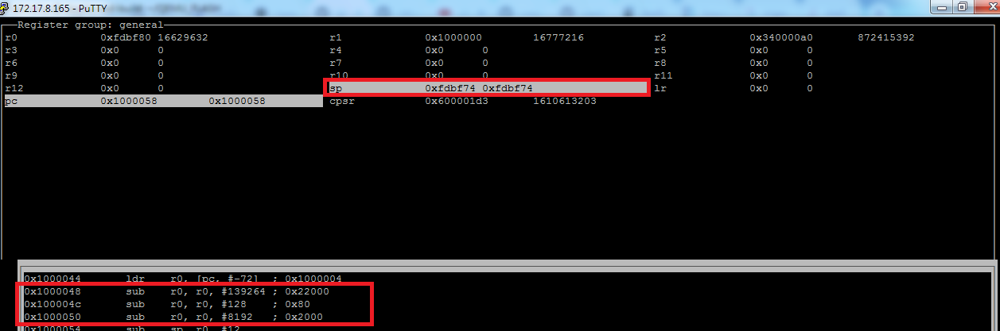
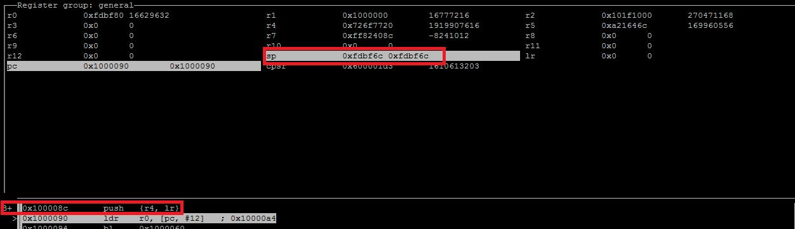

# start.S 
  
* Flash/RAM layout

   

   
* Stop at some loop point (b . ) and check register value .

   
* Use global variables defined value in lds script

   
* Prepare stack size 

   
* push stack
